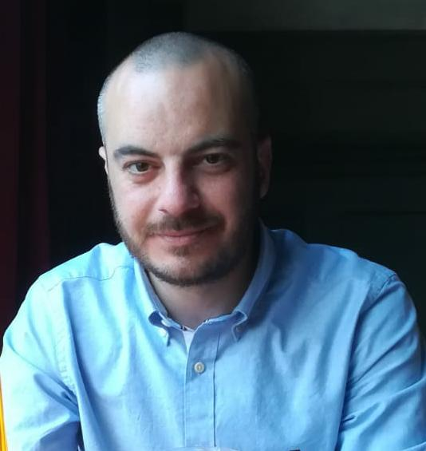

 
  manu.albano@gmail.com   Nationality: Italian

# Manuele Albano

Senior Writer with 5 years of experience writing customer-facing documentation for Saas. I have a solid background in localization and project management.

* Internal and customer-facing documentation
  
* Hands-on experience in Information Architecture (templating, tagging, taxonomy)
  
* Designed AI-powered content pipelines
  
* Proficient in Zendesk, Confluence, Jira

Working Experience
------------------

### Personio (Senior Content Developer, 2022/03 - present)

* Wrote customer-facing documentation and tutorials
  
* Documented internal processes on Confluence
  
* Helped defining the company's information achitecture (templates, tags, HC navigation)
  
* Implemented the first AI-powered content creation pipeline
  
* Created multimedia content with Clueso
    

### Keywords Studios (Senior Localization Project Manager, 2019/12 - 2022/02)

*   Acting as client-side PM, coordinating localization operations for four different games in up to 16 languages (EU and SEA)

*   In charge of overseeing the expansion of localization operations from one to four games: assessing risk, negotiating the schedule with the client, helping with the tools setup.

*   In charge of process and workflow improvement proposals, giving constant feedback to the client's engineering team to streamline the localization workflow and improve proprietary tools.
    

### Keywords Studios (Localization Project Manager, 2018/02 - 2019/12)

*  In charge of multiple A-list accounts, coordinating projects with up to 30 languages, with both in-house teams and freelancers

*  Client facing role: negotiating deadlines, defining requirements and scope

*  File management: preparing files for localization and uploading them in the relevant CAT tool

*  Resource management: participating in the on-boarding process for new resources, negotiating rates

*  Risk management: managing risks and communicating them to stakeholders throughout the project

*  Financial management: invoicing for both clients and vendors

### Webzen LTD (Assistant Localization Manager, 2016/06 - 2018/02)

*   Supervisor of the in-house translation team

*   Plan, schedule and prioritize localization projects, managing them to successful completion

*   Communicate status, issues and risks to project stakeholders, writing regular status reports

*   Create and maintain project documentation (style guides, glossaries)

*   Coordinate external vendors monitoring their progress

*   Project / file management in Memoq

*   Linguistic QA coordination

*   Manage relations with the company's CAT tool developer

*   Assist in the recruitment process

*   Train new hires in localization and CAT tool use
    

Education & Qualifications
--------------------------

*   BA degree in literature (Università degli Studi di Verona, October 2007)
    

Misc. Information
-----------------

*   Languages: English (Fluent), Spanish (Fluent), Italian (Native)
    
*   Availability: 2 month's notice

## Tools
- Zendesk
- Confluence
- Jira
- Clueso
